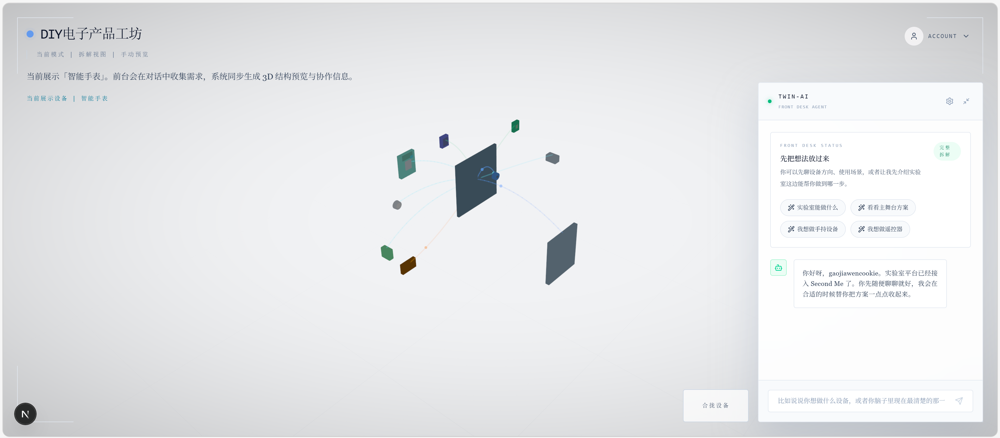
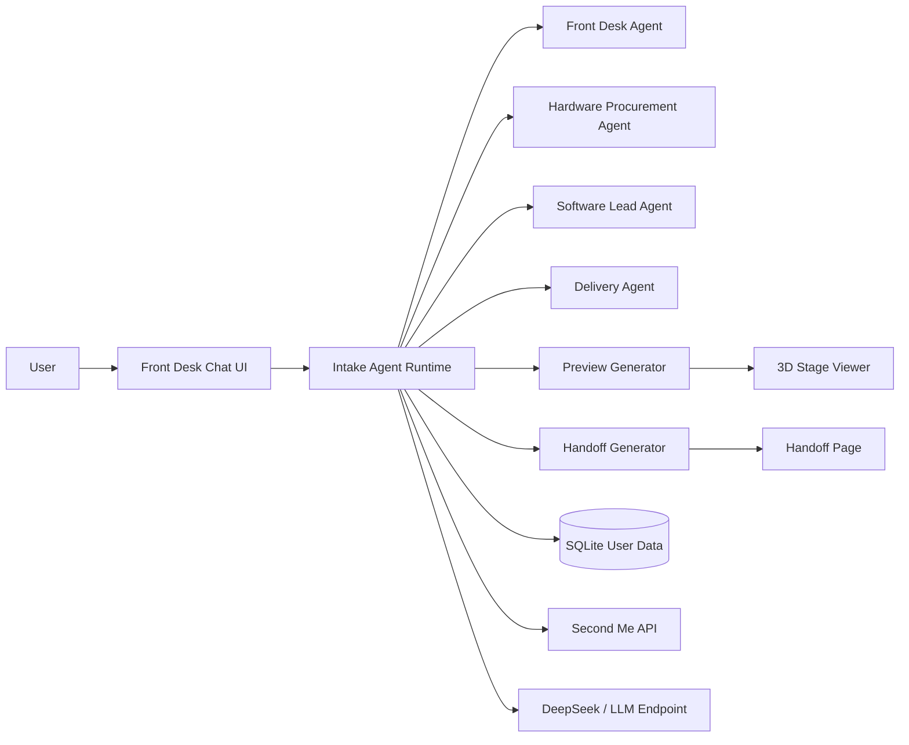

# DIY Electronics Workshop

A multi-agent, LLM-first demo platform for turning natural conversation into DIY electronics preview and handoff.

Language: English | [简体中文](README.zh-CN.md)


## Visual Preview

### Hero Screenshot

> Replace this image with your real product screenshot.



### Demo GIF

> Replace this GIF with your real interaction flow recording.


## Highlights

- Front-desk AI intake with natural dialogue
- Multi-agent collaboration panel (Front Desk / Hardware Procurement / Software Lead / Delivery)
- 3D preview stage with assembled/exploded visual mode
- Handoff generation from conversation context
- Lightweight user/account and interaction persistence (SQLite)
- Second Me OAuth + API integration, with optional DeepSeek LLM-first mode

## Tech Stack

- Next.js 16 (App Router)
- React 19 + TypeScript
- React Three Fiber / Drei / Three.js
- Node `sqlite` (`DatabaseSync`) for local persistence

## Quick Start (Local)

```bash
npm install
cp .env.example .env.local
# edit .env.local
npm run dev
```

Open: `http://localhost:3000`

## Environment Variables (Core)

Required for Second Me:

- `SECONDME_CLIENT_ID`
- `SECONDME_CLIENT_SECRET`
- `SECONDME_REDIRECT_URI`
- `SECONDME_API_BASE_URL`
- `SECONDME_OAUTH_URL`

Optional for LLM-first intake (recommended in production demos):

- `INTAKE_LLM_FIRST_MODE=true`
- `DEEPSEEK_API_KEY`
- `DEEPSEEK_BASE_URL` (default: `https://api.deepseek.com`)
- `DEEPSEEK_CHAT_MODEL` (example: `deepseek-chat`)
- `DEEPSEEK_INTAKE_CHAT_MODEL`
- `DEEPSEEK_INTAKE_REASONING_MODEL`

## Scripts

- `npm run dev` - start local dev server
- `npm run build` - production build
- `npm run start` - run production server
- `npm run demo:agents` - terminal demo for multi-agent workflow
- `npm run intake:regression` - intake regression check
- `npm run deploy:docker` - Docker deploy helper (PowerShell script)

## Docker Deployment

This repo includes:

- `Dockerfile`
- `docker-compose.prod.yml`

Basic deploy:

```bash
docker compose -f docker-compose.prod.yml up -d --build
docker compose -f docker-compose.prod.yml logs -f
```

The app listens on container port `3000` and maps `${PORT:-3000}:3000`.

## Project Structure

```text
src/
  app/                 # Next.js routes, APIs, pages
  components/          # UI + 3D viewer + chat interface
  lib/                 # intake workflow, orchestration, db, integration
scripts/               # demos and regression scripts
docs/                  # design docs, plans, test reports
```

## Architecture



## Demo Flow (Recommended for GitHub Visitors)

1. User describes a DIY electronics idea in natural language.
2. Front Desk Agent clarifies only key missing constraints.
3. Multi-agent collaboration appears with procurement/software/delivery viewpoints.
4. System generates 3D preview draft.
5. System generates handoff summary for execution.

## Documentation

- Docker deployment guide: [docs/DEPLOY_DOCKER.zh-CN.md](docs/DEPLOY_DOCKER.zh-CN.md)
- LLM-first migration notes: [docs/LLM_FIRST_MIGRATION.zh-CN.md](docs/LLM_FIRST_MIGRATION.zh-CN.md)
- User data DB notes: [docs/user-data-db.zh-CN.md](docs/user-data-db.zh-CN.md)

## Security Notes

- Never commit `.env.local`
- Rotate keys immediately if exposed
- Keep callback URL whitelist aligned with your deployed address

## License

See [LICENSE](LICENSE).
