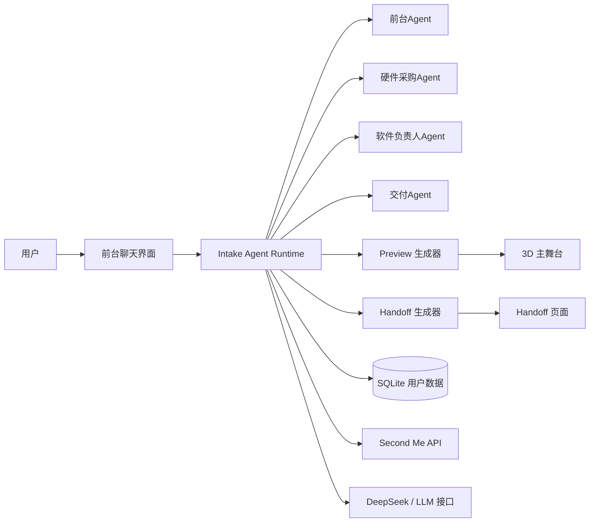

# DIY电子工坊

一个以 LLM 为核心、支持多 Agent 协同的 Demo 平台：把自然对话转成 DIY 电子产品预览与交接方案。

语言：简体中文 | [English](README.md)


## 可视化展示

### 首页主截图

> 这里建议替换成你的真实产品截图。


### Demo 动图

> 这里建议替换成完整交互录屏导出的 GIF。


## 核心能力

- 前台接待 Agent：自然对话收敛需求
- 多 Agent 协同面板：前台 / 硬件采购 / 软件负责人 / 交付
- 3D 主舞台预览：装配态与拆解态联动展示
- 从对话上下文自动生成 handoff
- 轻量账户与交互记录（SQLite）
- 支持 Second Me OAuth + API，兼容 DeepSeek 的 LLM-first 流程

## 技术栈

- Next.js 16（App Router）
- React 19 + TypeScript
- React Three Fiber / Drei / Three.js
- Node `sqlite`（`DatabaseSync`）

## 本地启动

```bash
npm install
cp .env.example .env.local
# 编辑 .env.local
npm run dev
```

访问：`http://localhost:3000`

## 环境变量（重点）

Second Me 必填：

- `SECONDME_CLIENT_ID`
- `SECONDME_CLIENT_SECRET`
- `SECONDME_REDIRECT_URI`
- `SECONDME_API_BASE_URL`
- `SECONDME_OAUTH_URL`

LLM-first（推荐 Demo/生产都开启）：

- `INTAKE_LLM_FIRST_MODE=true`
- `DEEPSEEK_API_KEY`
- `DEEPSEEK_BASE_URL`（默认 `https://api.deepseek.com`）
- `DEEPSEEK_CHAT_MODEL`（如 `deepseek-chat`）
- `DEEPSEEK_INTAKE_CHAT_MODEL`
- `DEEPSEEK_INTAKE_REASONING_MODEL`

## 常用命令

- `npm run dev`：开发模式
- `npm run build`：生产构建
- `npm run start`：生产启动
- `npm run demo:agents`：终端演示多 Agent 协同
- `npm run intake:regression`：回归测试 intake 流程
- `npm run deploy:docker`：Docker 一键部署辅助（PowerShell）

## Docker 部署

仓库已内置：

- `Dockerfile`
- `docker-compose.prod.yml`

基础部署：

```bash
docker compose -f docker-compose.prod.yml up -d --build
docker compose -f docker-compose.prod.yml logs -f
```

默认映射端口：`${PORT:-3000}:3000`

## 目录结构

```text
src/
  app/                 # 页面与 API 路由
  components/          # UI、3D 预览、聊天组件
  lib/                 # intake 编排、Agent 协作、数据库、集成
scripts/               # 演示脚本与回归脚本
docs/                  # 方案文档、计划、测试报告
```

## 系统架构图



## GitHub 访客演示路径（推荐）

1. 用户用自然语言描述 DIY 需求。
2. 前台 Agent 只补关键缺失信息。
3. 多 Agent 协同面板展示采购/软件/交付共识。
4. 生成 3D 预览草案。
5. 生成可执行 handoff 交接信息。

## 相关文档

- Docker 部署：`docs/DEPLOY_DOCKER.zh-CN.md`
- LLM-first 迁移说明：`docs/LLM_FIRST_MIGRATION.zh-CN.md`
- 用户数据说明：`docs/user-data-db.zh-CN.md`

## 安全建议

- 不要提交 `.env.local`
- 密钥泄露后立即轮换
- 回调地址与线上访问地址保持完全一致

## 许可证

见 [LICENSE](LICENSE)。
